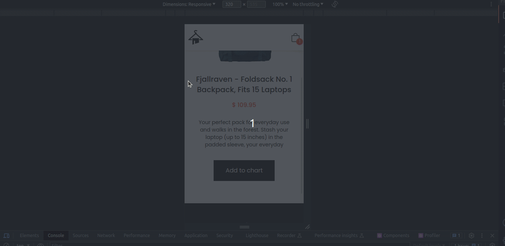

# E-commerce - React (Buyzzle) 🛒👜🛒👜

# Description 

This project is a responsive e-commerce website. The user can: view information about each product, filter products by category, and add / remove products from the cart. 
I styled the landing page with Tailwind CSS and built it with React Js. Also, Tailwind CSS helped with the responsiveness of the website.   
I created the routes to the other pages with react-router-dom.

## 🛠️ Technologies 

- React 
- Tailwind CSS
- Git and Github

## Prerequisites

- Node.js
- NPM

## Installation

1. Clone the repository:  `git clone https://github.com/kshree18/Ecommerce-Application-Buzzly.git`
2. Navigate to the project directory: `cd your_project`
3. Install the dependencies: `npm install`

LOCAL:
4. Run Backend: `cd backend` `npm start`
5.  Start the development server: `npm run dev`

DOCKER:
`docker-compose up --build`
6. Access at http://localhost:5173
